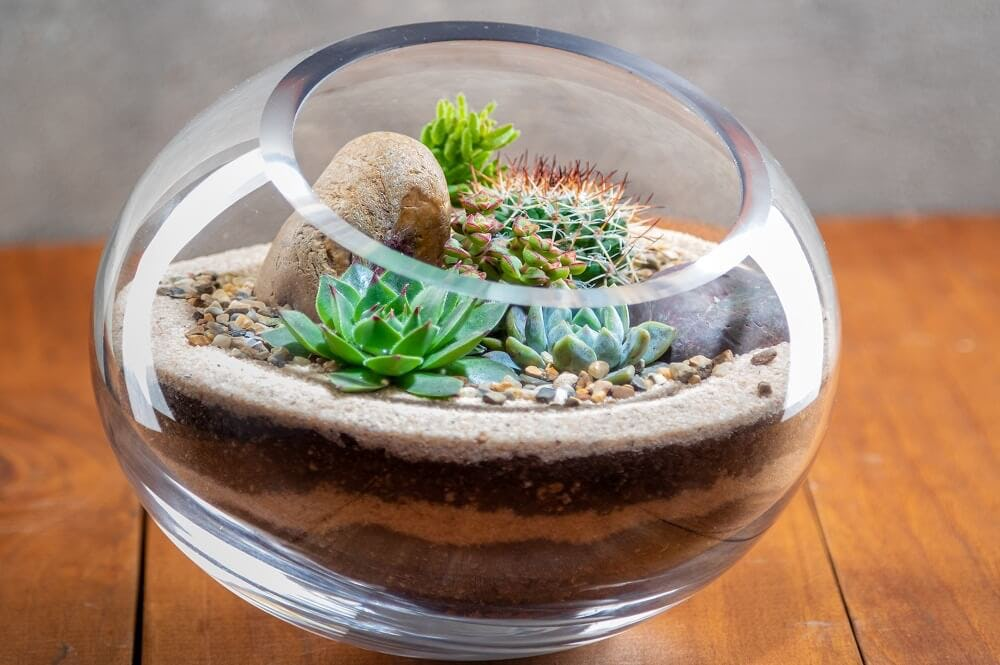

# Terrarium 23-A

## Descripcion
Proyecto de la clase de programación web orientado
 a practicar las bases del código HTML+ CSS + JAVASCRIPT 

 ## Autor 
 

 ## Notas de clase
 1. [HTML](https://eliezer070901-zany-telegram-vjwv5qx64x7fpg6j.github.dev/)
 2. CSS
 3. JS

